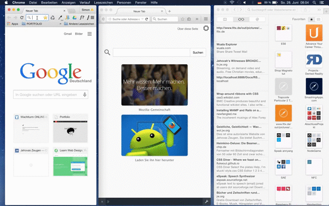

#Realtime Chat with Node.js
--------------------------

NodeJs Mongodb Socket.io Realtime chat  

#npm  
    $ npm i simple-nodejs-chat 
    
    $ cd/[path to]/simple-nodejs-chat/
      npm install  

#Setup 
 
 Install mongodb <a href="https://www.mongodb.org/">mongodb download</a>  
 Read <a href="http://docs.mongodb.org/manual/installation/">docs</a>  
 
  Start mongod:
 
    $ mongod    
     
    
 Start app:
        
     $ node server.js  
     
Open your favourite browser at localhost:3000 
  
#Demo  

online  
   
   See demo <a href="http://nodejschat-simgoat.rhcloud.com/"><em><u>HERE</u></em></a> using this as a skeleton  

desktop  
 
   
 
mobile  
 
 

 

     
     